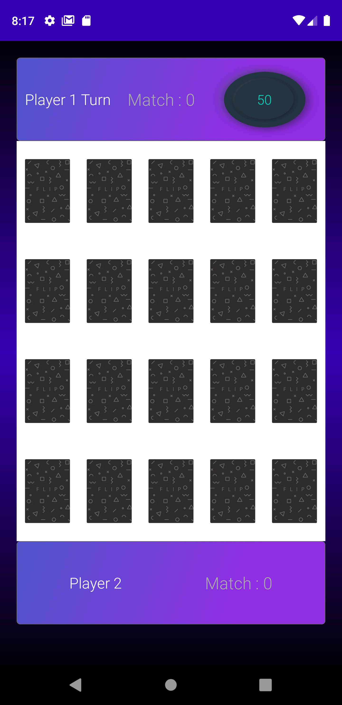

# MemoryFlipGame

This Game is Developed By Das Tarlochan Preet Singh 

# Features
- Made in Android Studio
- UI Designed in Adobe XD
- Made using Kotlin and Java
- Goal of game is simple uncover the cards and find there match before the time ends 
- Uses Json File to get Link to Images of cards
- Many Modes(Easy,Hard,Super Hard,2 Player) to Play in the Game
- Have feature to shuffle cards
- Have a Pause Screen
- Uses Media Player Class to play sound
- Uses Shared Preferences to store high scores
- Requires Internet as Images come from Shopify API Json(https://shopicruit.myshopify.com/admin/products.json?page=1&access_token=c32313df0d0ef512ca64d5b336a0d7c6)
- Uses Data View Model to pass data between screens
- Uses Custom Flip View for cards to flip in the game (https://github.com/wajahatkarim3/EasyFlipView)
- In Easy, Hard and Super hard Mode user play in 1 Player Mode, here user has to find all cards before time ends
- In 2 Player Mode , Two players compete against each other the player who finds most card matches wins the match.

# Screenshots:

<b>Splash Screen</b>
 

This is Splash screen of the App it stays for 3 seconds

<b>Home Screen</b>
 

This is Home screen of the App.
 We can play game , go to leaderboard ,see about us, or exit 

<b>About Us Screen</b>
 

This is About us screen of the App.

<b>Leaderboard Screen</b>
 

This is Leader Board screen of the App.
 We can see High scores of each mode 

<b>Mode Select Screen</b>
 

This is Mode Selection screen of the App.
 We can see all modes available here 

<b>Easy level Screen</b>
 

This is Easy level of the App

<b>Hard level Screen</b>
 

This is Hard level of the App

<b>Super Hard level Screen</b>
 

This is Super Hard level of the App

<b>2 Player level Screen</b>
 

This is Two Player Mode of the App
 Here Two player compete in given time

<b>2 Player Win Screen</b>
 

This is 2 Player Win Screen of the App

<b>Win Record Screen</b>
 

This is Win Screen when new Record is set.

<b>Win Screen</b>
 

This is Normal Win Screen when no new Record is set.

<b>Lose Screen</b>
 

This is Lose Screen when time is over.

<b>Game Pause Screen</b>
 

This is GamePause screen when back key pressed.
 Shuffle will reset the level

